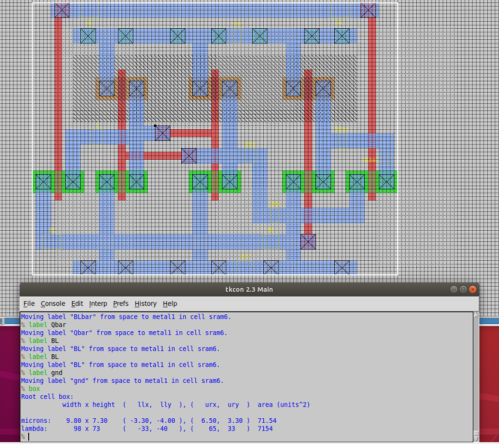
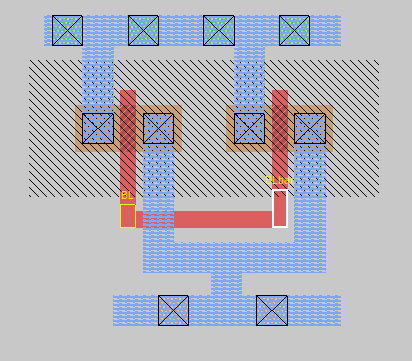

# avsdSram
### An SRAM IP Uniquely designed with open source tools.

Static RAM is a type of random-access memory that uses latching circuitry (flip-flop) to store each bit.
The Size of SRAM Specs is 32kbit/4k Bytes with 1.8v. 

## Block Symbol and pins

## Upcoming Future Works

The Circuit design of 6T SRAM alongwith Precharge, Sense amplifier is designed solely in opensouce tool and its characterstics is analyzed. As a post layout stage, the design's layout is drawn and spice netlist is extracted. As a part of upcoming work the next step is post layout simulation, verifying it with pre layout. The32kbit and PnR (Place and Route) flow and lastly GDS to be released.

## IP USAGE

The user of this IP has to install `Ngspice` for Circuit simulation and `Magic` for Layout.

## Getting Started with NGspice: An open Source Circuit Simulator

For ubuntu linux: 

To Install Ngspice, Open terminal and Type 

`sudo apt-get install -y ngspice`

### To Clone the IP Repository

1. Download the Zip file or use `git clone https://github.com/Anushar123/SRAM`

2. Change the path or directory using `cd/SRAM/Circuit-INV` to view the circuit.

3. Change the path or directory using `cd/SRAM/Netlist` to run the simulation.

### To run PreLayout Simulations

1. Go to the path or directory using `cd/SRAM/Netlist`

3. *To simulate transient Analysis* type :`ngspice Sram.cir.out`

   Or

   Type `ngspice` in terminal

   ngspice 1 -> source Sram.cir.out

### To View Simulation Plots:

ngspice 1 -> plot q

ngspice 1 -> plot qbar

 

ngspice 1 -> plot q qbar

 
 
 ngspice 1 -> plot bl

 
 
 ngspice 1 -> plot blbar

 
 
 ngspice 1 -> plot bl blbar

 
 
 
*To simulate dc Analysis*
 
Type :`ngspice sramdc.cir.out`

ngspice 1 -> plot bl q

.PNG)

 
To exit from Ngspice Shell type:

ngspice 1 ->  exit

## *Getting Started with Magic Layout*

 

 

 

 

 

## Author
Anusha R

# Contact Information
* Anusha.R Mtech (VLSI Design and Embedded Systems), Bangalore. anusha005r@gmail.com
* Kunalghosh Director VSD Corp.Pvt.ltd Kunalghosh@gmail.com
* PHILIPP GUHRING Software Architect at LibreSilicon Association pg@futureware.at
* Dr. GAURAV TRIVEDI Co-Principal Investigator,ECIT Academy and Associative Professor, EEE Department, IIT Guwahati trivedi@iitg.ac.in
