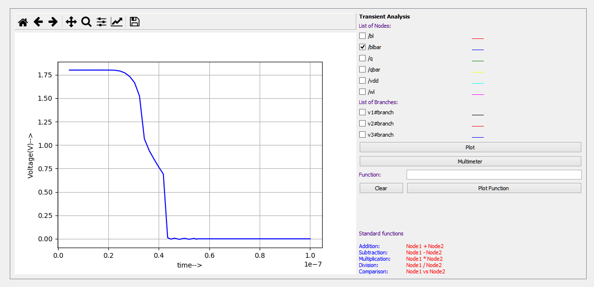
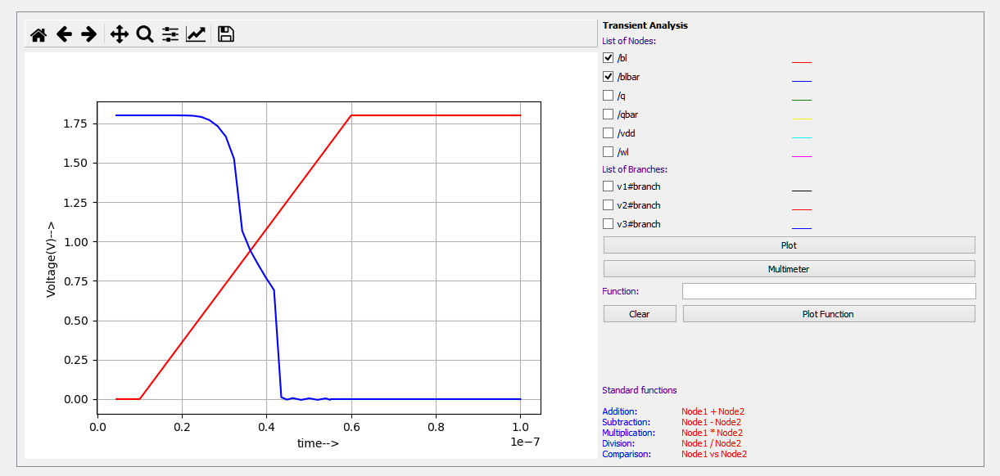
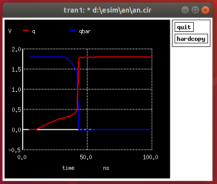
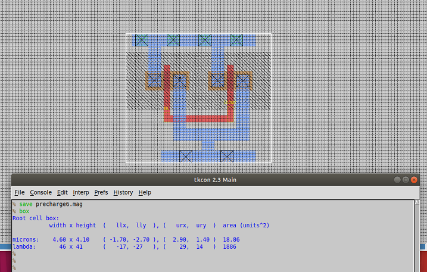

# avsdSRAM
## An SRAM IP Uniquely designed with open source tools.


Static RAM is a type of random-access memory that uses latching circuitry (flip-flop) to store each bit. The Size of SRAM Specs is 32kbit/4k Bytes with 1.8v. 

## Symbol and Pin Descriptions


## Upcoming Future Works

The Circuit design of 6T SRAM alongwith Precharge, Sense amplifier is designed solely in opensouce tool and its characterstics is analyzed. As a post layout stage, the design's layout is drawn and spice netlist is extracted. As a part of upcoming work the next step is post layout simulation, verifying it with pre layout. The32kbit and PnR (Place and Route) flow and lastly GDS to be released.

## IP USAGE

The user of this IP has to install `Ngspice` for Circuit simulation and `Magic` for Layout.

## Getting Started with NGspice: An open Source Circuit Simulator

```html
For ubuntu linux
```
To Install Ngspice, Open terminal and Type 
`sudo apt-get install -y ngspice`

### To run Simulation
```html
Clone the repository using `git clone https://github.com/Anushar123/SRAM`
```
1. Download the files or use `git clone https://github.com/Anushar123/SRAM`

2. Change the path or directory using `cd/SRAM/Netlist`


```html
For ubuntu linux
```
1. Download ESIM for Ubuntu from this link: https://esim.fossee.in/downloads
2. Open terminal or type `Ctrl+Alt+t` to open command terminal.
3. Change the directory using cd command followed by path to zip file.
4. Unzip the zip file using command: `unzip -q filename.zip` 
   Or use command: `unzip filename.zip -d /path/to/directory`; in case if ZIP file is in different directory
5. Change to eSim folder using cd command.
6. To install type: `./install-linux.sh --install`
7. To run eSim, you can directly run it from terminal by typing `esim`.
 
##  *Getting Started with Windows ESIM*
1. Create `new project` and save in a Specific directory.
2. Click on `new Schematic`
3. Schematic Editor opens
4. Draw the schematic and save it.

### *Schematic of Sramcell*


### *Schematic of Precharge*


### *Schematic of SenseAmplifier*


5. `Annotate` the schematic. 
6. Perform `Electrical rules check`, to check errors
7. Convert schematic into netlist from the toolbar icon. 
8. Click on the `kicad conversion` icon on left side of window for conversion of Kicad to ngspice netlist.
9. Choose and Fill up Analysis(transient or Dc) and Source details, along with device modelling(`Attaching libraries for pmos and nmos`). 
10. Click on Convert, Kicad to Ngspice conversion will be successfull.
11. Click on simulation icon on left toolbar window.
12. A ngspice terminal opens up for execution, along with ngspice python/simulation plot.
13. Choose appropriate nodes and click on plot to view waveforms.






.PNG)


## *Getting Started with Ubuntu-Linux Ngspice Simulation*
To Install Ngspice, Open terminal and Type 
`sudo apt-get install -y ngspice`
### To run Simulation
1. Download the files or use `git clone https://github.com/Anushar123/SRAM`

2. Change the path or directory using `cd/SRAM/Netlist`

3. *To simulate transient Analysis* type :`ngspice Sram.cir.out`

   Or

   Type `ngspice` in terminal

   ngspice 1 -> source Sram.cir.out

### To View Simulation Plots:

ngspice 1 -> plot q


ngspice 1 -> plot qbar

 

ngspice 1 -> plot q qbar

 
 
 ngspice 1 -> plot bl

 
 
 ngspice 1 -> plot blbar

 
 
 ngspice 1 -> plot bl blbar

 
 
 
*To simulate dc Analysis*
 
Type :`ngspice sramdc.cir.out`

ngspice 1 -> plot bl q

.PNG)

 
To exit from Ngspice Shell type:

ngspice 1 ->  exit

## *Getting Started with Magic Layout*

 


 


 


 


 


# Contact Information
* Anusha.R Mtech (VLSI Design and Embedded Systems), Bangalore. anusha005r@gmail.com
* Kunalghosh Director VSD Corp.Pvt.ltd Kunalghosh@gmail.com
* PHILIPP GUHRING Software Architect at LibreSilicon Association pg@futureware.at
* Dr. GAURAV TRIVEDI Co-Principal Investigator,ECIT Academy and Associative Professor, EEE Department, IIT Guwahati trivedi@iitg.ac.in
